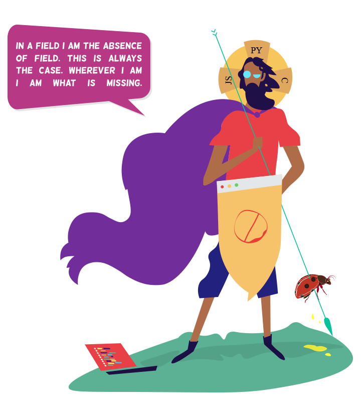

### Hi, I'm Chintan, also known as [Xscotophilic](https://xscotophilic.art/) on the internet. I enjoy painting, playing the violin, reading, and writing. I love working on open source projects that help society. I just want to be a good person, despite the fact that I have no idea who I am.

My GitHub Stats:

 

---

 
 

