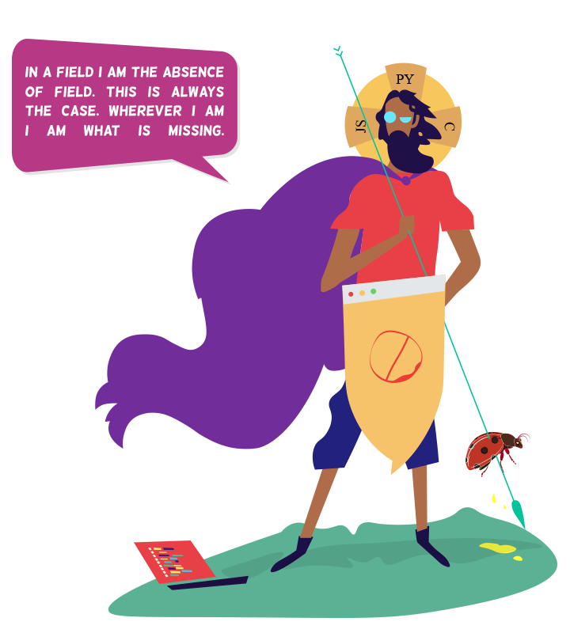

### Hi, I'm Chintan, also known as [Xscotophilic](https://xscotophilic.me/) on the internet. I enjoy painting, playing the violin, reading, and writing. I love working on open source projects that help society. I just want to be a good person, despite the fact that I have no idea who I am.

**Languages and Tools:**

<code></code>
<code></code>
<code></code>
<code></code>
<code></code>
<code></code>
<code></code>
<code></code>
<code></code>
<code></code>

If you like what I do, maybe consider buying me a coffee🥺

My GitHub Stats:

 

---

